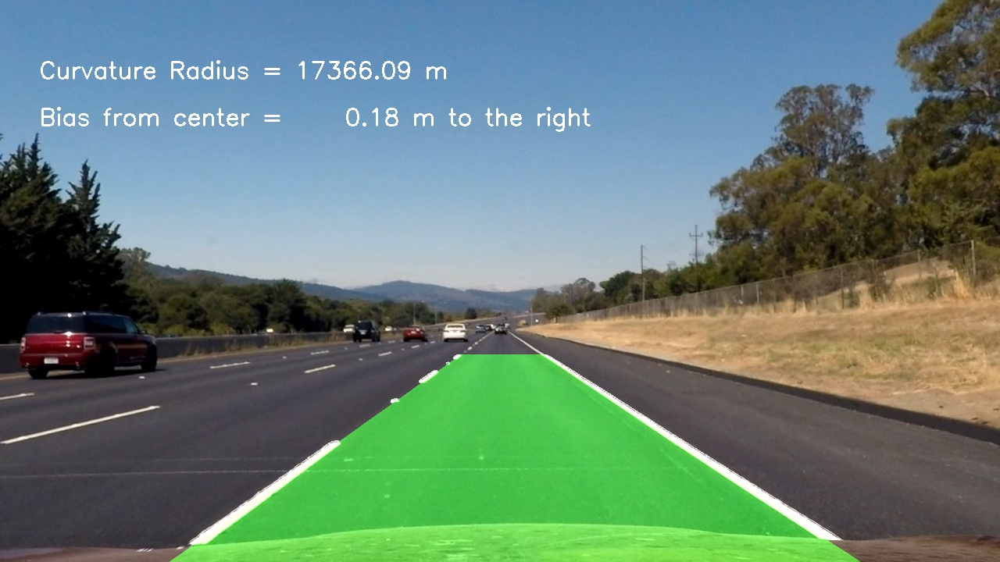

## Advanced Lane Finding
[](http://www.udacity.com/drive)


In this project, the goal is to write a software pipeline using more advanced techniques to identify lane lines on the road.  

Firstly we will need to calibrate the camera and extract the calibration information and then use this information to correct camera distorations for the input images.

Afterwards will do image transformation and change image prespective to get the birds eye view to detect laneLines and compute the lane curvature and the Bias from center.


The project is built on the environment of [CarND-Advanced-Lane-Lines](https://github.com/udacity/CarND-Advanced-Lane-Lines) that can be used as a starting point. Also it's needed to cover all of the [rubric points](https://review.udacity.com/#!/rubrics/1966/view) for this project.


---

Project Steps:
---

The goals / steps of this project are the following:

* Compute the camera calibration matrix and distortion coefficients given a set of chessboard images.
* Apply a distortion correction to raw images.
* Use color transforms, gradients, etc., to create a thresholded binary image.
* Apply a perspective transform to rectify binary image ("birds-eye view").
* Detect lane pixels and fit to find the lane boundary.
* Determine the curvature of the lane and vehicle position with respect to center.
* Warp the detected lane boundaries back onto the original image.
* Output visual display of the lane boundaries and numerical estimation of lane curvature and vehicle position.


The images for camera calibration are stored in the folder called `camera_cal`.  The images in `test_images` are for testing your pipeline on single frames.  


Examples of the output from each stage of the pipeline are saved in the folder called `output_images`, Also The video called `project_video.mp4` is the video that the pipeline should work well on.  

Access [Rubric](https://review.udacity.com/#!/rubrics/571/view) Points from here.

---

## **Advanced Lane Finding Project**


[//]: # (Image References)

[image0]: ./test_images/straight_lines2.jpg "Original"
[image1]: ./images_writeup/straight_lines2_undistorted.jpg "Undistorted"
[image2]: ./images_writeup/straight_lines2_Warped.jpg "Road Transformed"
[image3]: ./images_writeup/straight_lines2_binaryMask.jpg "Binary Example"
[image4]: ./images_writeup/straight_lines2_Output_Mask.jpg "Fit Visual"
[image5]: ./images_writeup/straight_lines2_result.jpg "Output"
[video1]: ./project_video.mp4 "Video"


### Here we discuss project steps and describe how they are implemented:  

---


### Camera Calibration

#### Computing the camera matrix and distortion coefficients. 

The code for this step is contained in the first code cell of the IPython notebook located in "./Advanced-Lane-Finding.ipynb".  
Main functions used are:
```python
    
    ret, corners = cv2.findChessboardCorners(gray, (nx, ny), None)

    # If found, draw corners
    if ret == True:
        # Draw and display the corners
        imgpoints.append(corners)
        objpoints.append(objp)
        
        cv2.drawChessboardCorners(img, (nx, ny), corners, ret)
        
        cv2.imwrite((folder_out+fname),img)


```

I start by preparing "object points", which will be the (x, y, z) coordinates of the chessboard corners in the world. Here I am assuming the chessboard is fixed on the (x, y) plane at z=0, such that the object points are the same for each calibration image.  Thus, `objp` is just a replicated array of coordinates, and `objpoints` will be appended with a copy of it every time I successfully detect all chessboard corners in a test image.  `imgpoints` will be appended with the (x, y) pixel position of each of the corners in the image plane with each successful chessboard detection.  

These `objpoints` and `imgpoints` are saved as'.pickle' files for later usage in the main pipeline without running CameraCalibration everytime.

I then used the output `objpoints` and `imgpoints` to compute the camera calibration and distortion coefficients using the `cv2.calibrateCamera()` function.  I applied this distortion correction to the test image using the `cv2.undistort()` function as follows:
```python
    ret, mtx, dist, rvecs, tvecs = cv2.calibrateCamera(objpoints, imgpoints, gray.shape[::-1],None,None)

    undist = cv2.undistort(img, mtx, dist, None, mtx)

```

Here is the obtained result: 

![alt text][image1]


---
### Pipeline for single images:

#### 1. An example of a distortion-corrected image.

To demonstrate this step, I will describe how I apply the distortion correction to one of the test images like this one:
![alt text][image0]

Firstly we load the `objpoints` and `imgpoints` saved from the previous step, use them with `cv2.calibrateCamera()` function and `cv2.undistort()` to obtain the corrected image:
![alt text][image1]

#### 2. Color transforms, gradients for thresholded binary image. 

Next, By using a combination of S color chanel and magnitude gradient thresholds to generate a binary image as in function `binary_thresh()`as follows:
```python

    hls = cv2.cvtColor(image, cv2.COLOR_RGB2HLS)
    l_channel = hls[:,:,1]
    s_channel = hls[:,:,2]
    
    # Threshold color channel
    s_binary = np.zeros_like(s_channel)
    s_binary[(s_channel >= s_thresh[0]) & (s_channel <= s_thresh[1])] = 1
    
    # Apply each of the thresholding functions0
    mag_binary = mag_threshold(image, sobel_kernel=sobel_kernel, m_thresh=mag_thresh)
    
    color_binary = np.zeros_like(mag_binary)
    
    color_binary[((mag_binary == 1) | (s_binary == 1))] = 1

```

Here's an example of my output after applying this step.

![alt text][image3]

#### 3. Perspective transformation.

The code for perspective transform includes a function called `warper()`, which appears in lines 1 through 8 in the file `example.py` (output_images/examples/example.py) (or, for example, in the 3rd code cell of the IPython notebook).  The `warper()` function takes as inputs an image (`img`), as well as source (`src`) and destination (`dst`) points.  I chose the hardcode the source and destination points in the following manner:

```python
src = np.float32(
    [[(img_size[0] / 2) - 55, img_size[1] / 2 + 100],
    [((img_size[0] / 6) - 10), img_size[1]],
    [(img_size[0] * 5 / 6) + 60, img_size[1]],
    [(img_size[0] / 2 + 55), img_size[1] / 2 + 100]])
dst = np.float32(
    [[(img_size[0] / 4), 0],
    [(img_size[0] / 4), img_size[1]],
    [(img_size[0] * 3 / 4), img_size[1]],
    [(img_size[0] * 3 / 4), 0]])
```

This resulted in the following source and destination points:

| Source        | Destination   | 
|:-------------:|:-------------:| 
| 585, 460      | 320, 0        | 
| 203, 720      | 320, 720      |
| 1127, 720     | 960, 720      |
| 695, 460      | 960, 0        |

I verified that my perspective transform was working as expected by drawing the `src` and `dst` points onto a test image and its warped counterpart to verify that the lines appear parallel in the warped image.

![alt text][image4]

#### 4. Describe how (and identify where in your code) you identified lane-line pixels and fit their positions with a polynomial?

Then I did some other stuff and fit my lane lines with a 2nd order polynomial kinda like this:

![alt text][image5]

#### 5. Describe how (and identify where in your code) you calculated the radius of curvature of the lane and the position of the vehicle with respect to center.

I did this in lines # through # in my code in `my_other_file.py`

#### 6. Provide an example image of your result plotted back down onto the road such that the lane area is identified clearly.

I implemented this step in lines # through # in my code in `yet_another_file.py` in the function `map_lane()`.  Here is an example of my result on a test image:

![alt text][image6]

---

### Pipeline (video)

#### 1. Provide a link to your final video output.  Your pipeline should perform reasonably well on the entire project video (wobbly lines are ok but no catastrophic failures that would cause the car to drive off the road!).

Here's a [link to my video result](./project_video.mp4)

---

### Discussion

#### 1. Briefly discuss any problems / issues you faced in your implementation of this project.  Where will your pipeline likely fail?  What could you do to make it more robust?

Here I'll talk about the approach I took, what techniques I used, what worked and why, where the pipeline might fail and how I might improve it if I were going to pursue this project further.  
